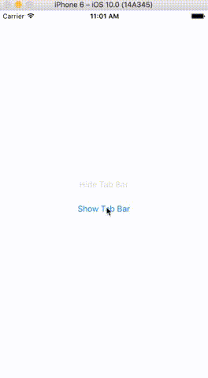

# UITabBarController+KTHidden

[](https://travis-ci.org/kasimte/UITabBarController-KTHidden)
[](http://cocoapods.org/pods/UITabBarController+KTHidden)
[](http://cocoapods.org/pods/UITabBarController+KTHidden)
[](http://cocoapods.org/pods/UITabBarController+KTHidden)
[](http://clayallsopp.github.io/readme-score?url=kasimte/uitabbarcontroller-kthidden)

A UITabBarController category with UITabBar hide and show animations.

## Example

To run the example project, clone the repo, and run `pod install` from the Example directory first.



## Installation

UITabBarController+KTHidden is available through [CocoaPods](http://cocoapods.org). To install
it, simply add the following line to your Podfile:

```ruby
pod "UITabBarController+KTHidden"
```

## Requirements

- XCode 8.
- iOS 8 or above.

## Usage

Hide the tab bar like so:

```
[tabBarController setTabBarHidden:YES animated:YES completion:nil];
```

Show the tab bar like so:

```
[tabBarController setTabBarHidden:NO animated:YES completion:nil];
```

## Author

Kasim Te, kasimte@gmail.com

## License

UITabBarController+KTHidden is available under the MIT license. See the LICENSE file for more info.
